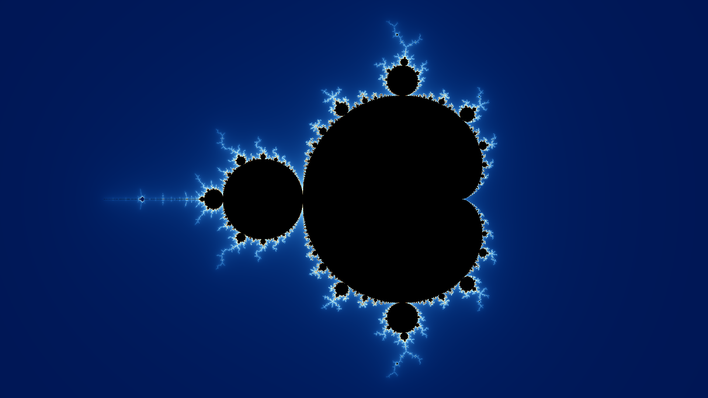
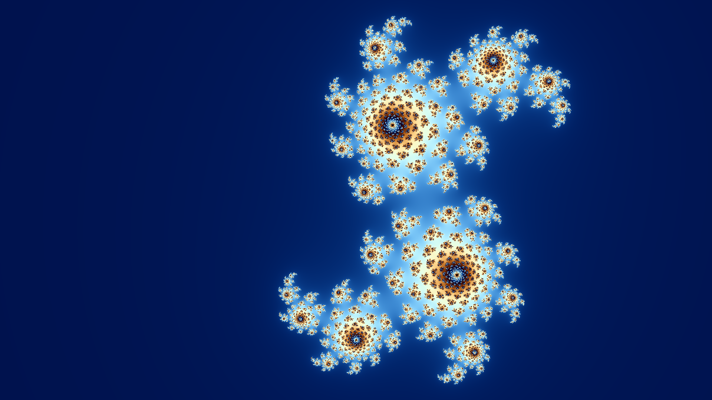

# Fractal Generator in Rust

This repository contains a Rust application for generating fractal images such as the Mandelbrot set, Julia set, and Burning Ship fractal.

## Overview

The code is structured into modules to handle complex number arithmetic and the generation of different fractals. Images are generated using the `image` crate and saved in PNG format.

## Generated Images

Here are some of the beautiful fractals generated by this application:

### Mandelbrot Set



### Julia Set



### Burning Ship Fractal (THIS NEEDS TO BE FIXEDDDD)


## Acknowledgments

I would like to express my gratitude to Jeroen Rotgers for his informative blog post on creating the Mandelbrot set in Rust ([Creating the Mandelbrot Set in Rust](https://rotgers.io/posts/mandelbrot-rust/)). The clear explanation and code samples provided a solid foundation that greatly assisted in the development of this project. This exploration into fractals in Rust would not have been possible without the knowledge shared in the post. A heartfelt thank you to Jeroen for his contribution to the Rust community and for inspiring this project.

## How to Run

Ensure you have Rust and Cargo installed. Then clone this repository, navigate into the project directory, and run:

```shell
cargo run
```

The images will be generated in the root directory of the project.
